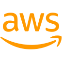

## Hola, soy Kevin Rodriguez 👋

  <h2>👨‍💻 Sobre mí</h2>
      
Soy desarrollador <strong>Full Stack con +6 años de experiencia</strong>, creando productos web de punta a punta: interfaces, APIs, datos y despliegues.

      <table>
        <tr>
          <td width="50%" valign="top">
            <ul>
              <li>Desarrollo aplicaciones web completas, desde interfaces modernas hasta APIs y servicios preparados para crecer.</li>
              <li>Trabajo principalmente con <strong>Node.js, TypeScript y NestJS</strong>, y cuento con casi <strong>2 años de experiencia con C# y .NET</strong>.</li>
              <li>Aplico Clean Architecture, DDD y arquitectura hexagonal cuando aportan valor al producto.</li>
              <li>Experiencia con <strong>AWS, GCP, Docker y Kubernetes</strong>.</li>
            </ul>
          </td>
          <td width="50%" valign="top">
            <ul>
              <li>Trabajo con bases de datos relacionales y NoSQL: PostgreSQL, MySQL, MongoDB, Firestore y Redis.</li>
              <li>Interesado en <strong>IA, automatización y DevOps</strong>.</li>
              <li>Mi objetivo es construir productos simples, eficientes y mantenibles.</li>
            </ul>
          </td>
        </tr>
      </table>
      <h2>🛠️ Tecnologías</h2>
      <table>
        <tr>
          <td><strong>APIs &amp; Servicios</strong></td>
          <td>
             <code>Node.js</code>
             <code>TypeScript</code>
             <code>NestJS</code>
             <code>Express</code>
             <code>Fastify</code>
             <code>.NET</code>
             <code>C#</code>
          </td>
        </tr>
        <tr>
          <td><strong>Frontend</strong></td>
          <td>
             <code>Angular</code>
             <code>React</code>
             <code>Vue.js</code>
          </td>
        </tr>
        <tr>
          <td><strong>Bases de datos</strong></td>
          <td>
             <code>PostgreSQL</code>
             <code>MySQL</code>
             <code>MongoDB</code>
             <code>Redis</code>
             <code>Firestore</code>
          </td>
        </tr>
        <tr>
          <td><strong>DevOps &amp; Cloud</strong></td>
          <td>
             <code>AWS</code>
             <code>GCP</code>
             <code>Docker</code>
             <code>Kubernetes</code>
             <code>GitHub Actions</code>
             <code>Linux</code>
          </td>
        </tr>
      </table>
      <h2>🚀 Proyectos destacados</h2>
      <table>
        <tr>
          <td width="33%" valign="top">
            <h3><a href="https://github.com/kevinsrb/inventory-management-api">inventory-management-api</a></h3>
            
API REST de inventario con NestJS y TypeScript, diseñada con arquitectura limpia, reglas de dominio explícitas y consistencia de datos.

            
<strong>Stack:</strong> <code>NestJS</code> <code>TypeScript</code> <code>PostgreSQL</code> <code>Prisma</code> <code>Jest</code> <code>Docker</code>

          </td>
          <td width="33%" valign="top">
            <h3><a href="https://github.com/kevinsrb/create-flex-stack">create-flex-stack</a></h3>
            
Generador TypeScript para crear APIs Express y frontends React + Vite con arquitectura, persistencia y herramientas opcionales.

            
<strong>Stack:</strong> <code>TypeScript</code> <code>Express</code> <code>React</code> <code>Prisma</code> <code>Docker</code>

          </td>
          <td width="34%" valign="top">
            <h3><a href="https://github.com/kevinsrb/yugioh-app">yugioh-app</a></h3>
            
Explorador frontend de cartas de Yu-Gi-Oh! con búsqueda, filtros, favoritos persistentes, caché de peticiones y modo oscuro.

            
<strong>Stack:</strong> <code>React</code> <code>Vite</code> <code>TypeScript</code> <code>TanStack Query</code> <code>Tailwind CSS</code> <code>Zustand</code>

          </td>
        </tr>
      </table>
      
<a href="https://github.com/kevinsrb?tab=repositories">Ver todos los repositorios →</a>

## 📊 Actividad en GitHub

  
  

### 🤝 Conectemos

**Full Stack · Node.js · C#/.NET · Cloud · IA**

