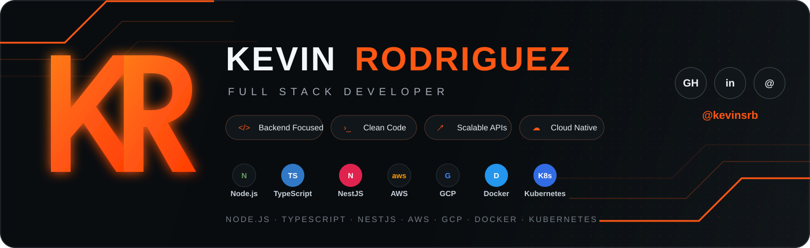

## Hola, soy Kevin Rodriguez 👋

 

---

## 👨‍💻 Sobre mí

Soy desarrollador **Full Stack** con más de **6 años de experiencia**, con un fuerte enfoque en **backend**, diseño de APIs y construcción de soluciones mantenibles y escalables.

- 🚀 Me gusta construir APIs robustas, servicios backend y arquitecturas preparadas para crecer.
- 🧩 Trabajo con **Node.js, TypeScript, NestJS y .NET/C#**, aplicando principios de Clean Architecture, DDD y arquitectura hexagonal cuando el problema lo requiere.
- ☁️ Experiencia trabajando con **AWS, GCP, Docker y Kubernetes**.
- 🗄️ Trabajo con bases de datos relacionales y NoSQL como **PostgreSQL, MySQL, MongoDB, Firestore y Redis**.
- 🤖 Interesado en **IA, automatización, arquitectura de software y DevOps**.
- 🎯 Mi objetivo es seguir creciendo técnicamente, aportar valor a productos reales y construir software que sea fácil de mantener y evolucionar.

## 🛠️ Tecnologías

### Backend

### Frontend

### Bases de datos

### Cloud & DevOps

### Desarrollo & calidad

## 🚀 Proyectos destacados

<table>
<tr>
<td width="50%" valign="top">

### 📦 [inventory-management-api](https://github.com/kevinsrb/inventory-management-api)

API de gestión de inventario orientada a dominio, construida con **NestJS + TypeScript**.

`NestJS` `PostgreSQL` `Prisma` `Jest` `Docker`

- Arquitectura limpia/hexagonal y módulos por dominio.
- Reglas de negocio, value objects y casos de uso explícitos.
- Control de consistencia y concurrencia en operaciones de inventario.
- Swagger/OpenAPI y pruebas automatizadas.

</td>
<td width="50%" valign="top">

### ⚡ [create-flex-stack](https://github.com/kevinsrb/create-flex-stack)

Generador de proyectos **TypeScript** para crear APIs Express y, opcionalmente, frontends React + Vite.

`TypeScript` `Express` `React` `Prisma` `Docker`

- Diferentes estilos arquitectónicos, incluyendo Clean y Hexagonal.
- PostgreSQL, MySQL, SQLite y MongoDB.
- Prisma, TypeORM y Mongoose.
- Opciones para JWT, RBAC, Swagger, Redis, Jest y Docker.

</td>
</tr>
</table>

## 📊 GitHub

### 🤝 Conectemos

Estoy abierto a colaborar en proyectos interesantes y a conversar sobre **backend, arquitectura, Node.js, cloud e IA**.

Diseñando sistemas que crecen sin convertir el código en un problema.

