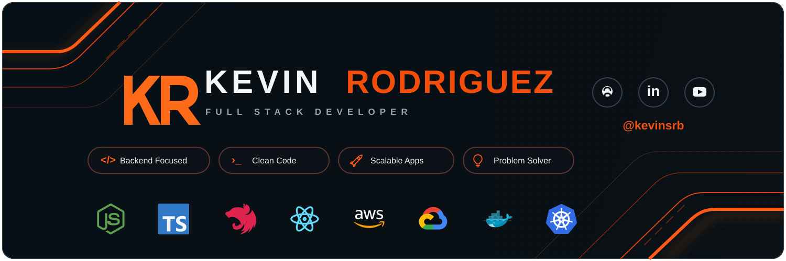

## Hola, soy Kevin Rodriguez 👋

  
  
  

## 👨‍💻 Sobre mí

Soy desarrollador **Full Stack con +6 años de experiencia**, enfocado principalmente en **backend, APIs y arquitectura de software** con Node.js y TypeScript.

- 🚀 Construyo APIs robustas y servicios backend preparados para crecer.
- 🧩 Trabajo con **Node.js, TypeScript, NestJS y .NET/C#**, aplicando Clean Architecture, DDD y arquitectura hexagonal cuando aportan valor.
- ☁️ Experiencia con **AWS, GCP, Docker y Kubernetes**, además de PostgreSQL, MySQL, MongoDB, Firestore y Redis.
- 🤖 Interesado en **IA, automatización y DevOps**, siempre buscando soluciones simples, mantenibles y eficientes.

## 🛠️ Tecnologías

 

## 🚀 Proyectos destacados

<a href="https://github.com/kevinsrb?tab=repositories">Ver todos los repositorios →</a>

<table>
<tr>
<td width="50%" valign="top">

### 📦 [inventory-management-api](https://github.com/kevinsrb/inventory-management-api)

API REST de gestión de inventario construida con **NestJS + TypeScript**, orientada a reglas de negocio explícitas y consistencia de datos.

**Stack:** `NestJS` `PostgreSQL` `Prisma` `Jest` `Docker`

- Clean / Hexagonal Architecture.
- Value Objects, políticas de dominio y casos de uso.
- Control de concurrencia y operaciones transaccionales.
- Swagger/OpenAPI y pruebas automatizadas.

</td>
<td width="50%" valign="top">

### ⚡ [create-flex-stack](https://github.com/kevinsrb/create-flex-stack)

Generador de proyectos **TypeScript** para crear APIs Express y frontends React + Vite opcionales.

**Stack:** `TypeScript` `Express` `React` `Prisma` `Docker`

- Arquitectura Layered, Clean o Hexagonal.
- PostgreSQL, MySQL, SQLite y MongoDB.
- Prisma, TypeORM y Mongoose.
- JWT, RBAC, Swagger, Redis, Jest y Docker opcionales.

</td>
</tr>
</table>

## 📊 Actividad en GitHub

### 🤝 Conectemos

**Backend · Node.js · Arquitectura · Cloud · IA**

